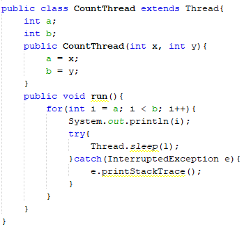
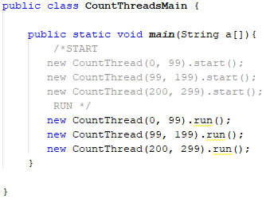

# Laboratorio#3 Arsw

Nombre: 
* Sergio Alejandro Peña Pinto

## *Part I - Introduction to threads in JAVA*

1. In agreement with the lectures, complete the classes CountThread, so that they define the life cycle of a thread that prints the numbers between A and B on the screen.

2. Complete the main method of the CountMainThreads class so that:
  * Create 3 threads of type CountThread, assigning the first interval [0..99], the second [99..199], and the third [200..299]. 
  * Start the three threads with start(). Run and check the output on the screen. 
  * Change the beginning with start() to run(). How does the output change? Why?
  

The difference between the methods start () and run () is that in the first one it makes and shows in screen in disorder, it depends on which thread is executed first and in the second one it is done and it shows in screen in order of the threads.
