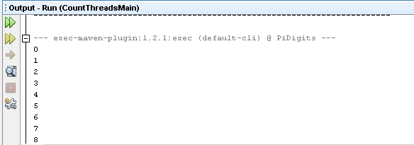
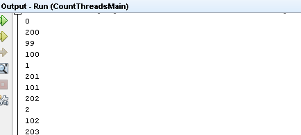
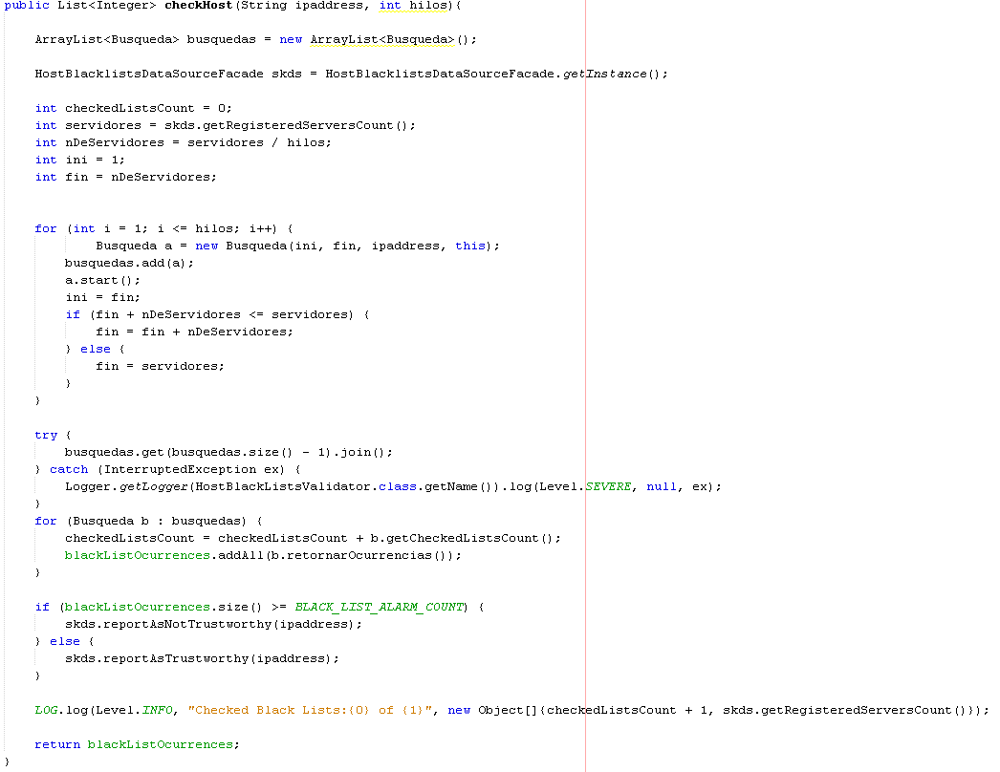
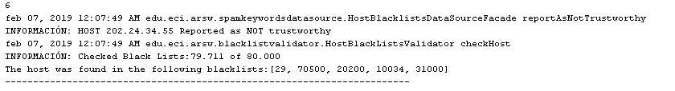
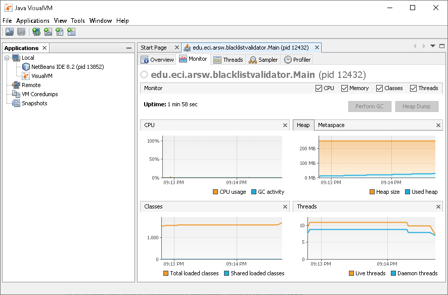
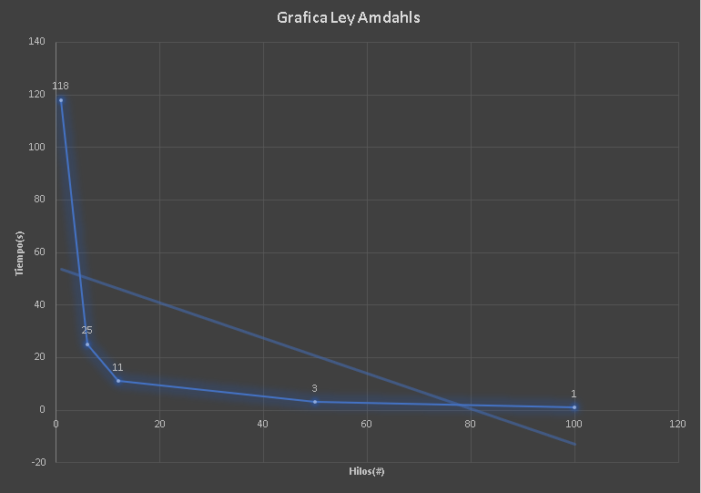
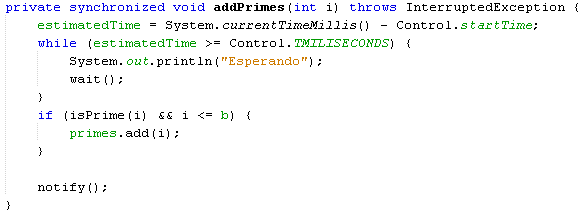
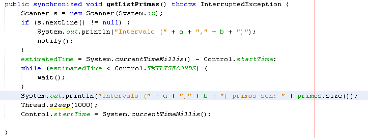
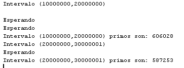
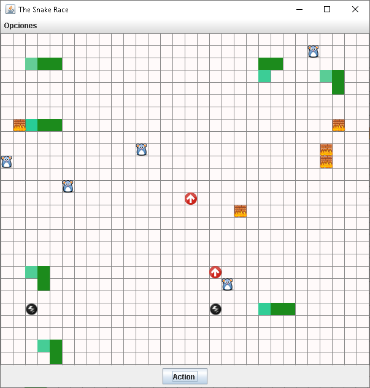

# Laboratorio#3 Arsw

Nombre: 
* Sergio Alejandro Peña Pinto

## *Part I - Introduction to threads in JAVA*

1. In agreement with the lectures, complete the classes CountThread, so that they define the life cycle of a thread that prints the numbers between A and B on the screen.

2. Complete the main method of the CountMainThreads class so that:
  * Create 3 threads of type CountThread, assigning the first interval [0..99], the second [99..199], and the third [200..299]. 
  * Start the three threads with start(). Run and check the output on the screen. 
  * Change the beginning with start() to run(). How does the output change? Why?
  

The difference between the methods start () and run () is that in the first one it makes and shows in screen in disorder, it depends on which thread is executed first and in the second one it is done and it shows in screen in order of the threads.

## *Part II - Black List Search Exercise*

For this exercise we performed what they requested, with parallelism as follows:

With this implementation it is possible to distribute the list of servers that were given to us, so that several threads will execute the search in a parallel way and thus be able to give a result in a more efficient way. The following results were generated:

## *Part III - Discussion*

It can be somewhat inefficient, because if I have found the minimum number of servers to say it is not reliable then I should not keep searching, for which it is proposed to have a variable where it counts in how many servers it has been found and is going modifying according to whether the IP is on a server or not, however this would lead to having to implement critical sections and synchronization.

## *Part IV - Performance Evaluation*

The instructions of JVisualVM is done with each of the cases.

You can see that in the image that is becoming faster as the number of threads increases.

* The best performance is not achieved with 500 threads since there is a limit to the improvement that can be achieved using concurrency, said limit depends directly on the part that can not be improved (the sequential part). That is why when using 200 threads the yields are quite similar, because even though they are included more, there will be a point where they stop improving and remain constant.

* The solution using twice as many wires is twice as fast as the solution using only as many wires as the processor's cores.

* If 100 CPUs are used and a thread is given to a single machine, the performance of insurance will improve considerably since each thread will have the processor available all the time and it will not have to exchange the processor with the others so it is probably finish faster.

## *Part 1*

For the first part of that section, it was done with wait / notify as a producer-consumer form.

The results were:

## *Part 3*

The results can be seen in ANSWERS.txt.

The respective start / pause / resume buttons can be seen in the options menu in the following image:

